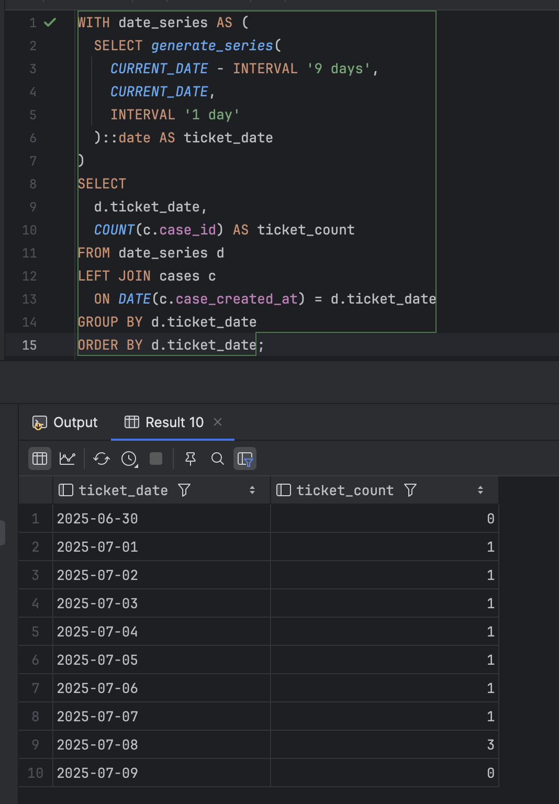
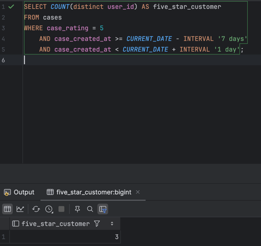
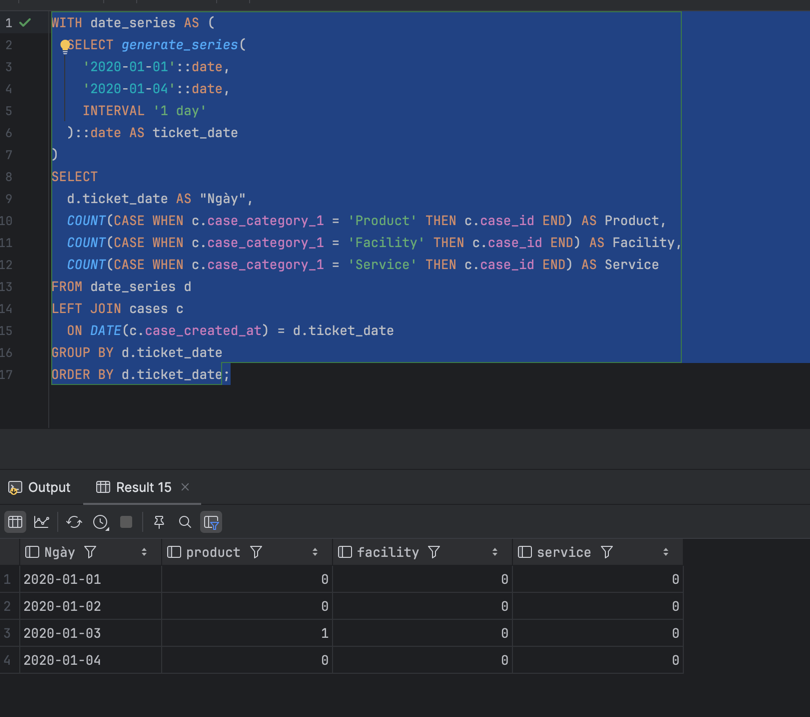
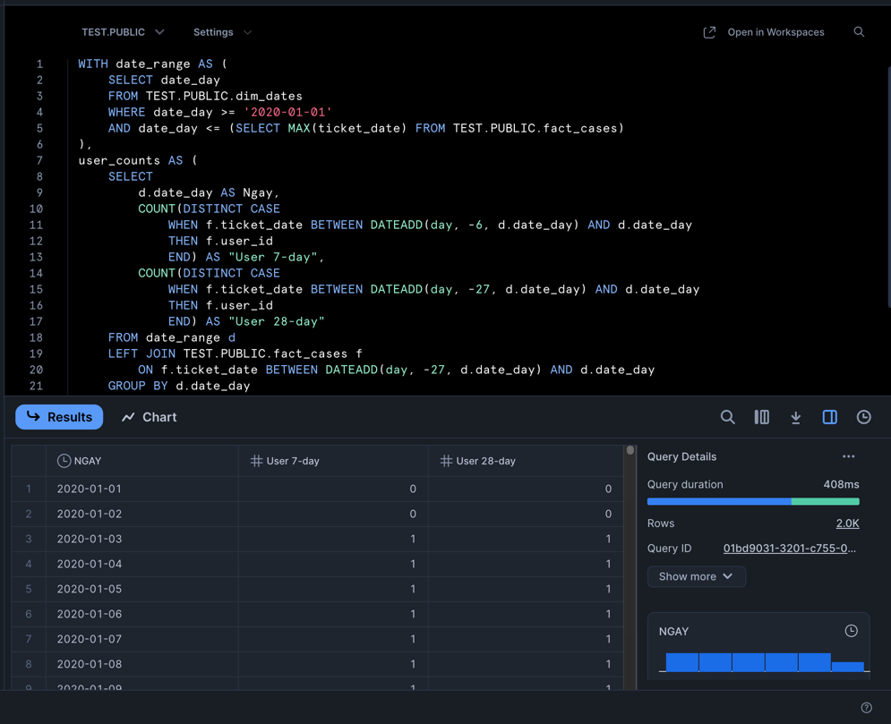

# test_cellphones

## Chuẩn bị dữ liệu
```postgresql
create table public.cases
(
    case_id         integer not null
        primary key,
    user_id         integer,
    comment         text,
    case_created_at timestamp,
    case_rating     integer,
    case_category_1 text,
    case_category_2 text
);
```

## 1. Viết SQL để lấy số ticket của 10 ngày gần nhất, lưu ý có thể có những ngày không có ticket nào

```postgresql
WITH date_series AS (
  SELECT generate_series(
    CURRENT_DATE - INTERVAL '9 days',
    CURRENT_DATE,
    INTERVAL '1 day'
  )::date AS ticket_date
)
SELECT
  d.ticket_date,
  COUNT(c.case_id) AS ticket_count
FROM date_series d
LEFT JOIN public.cases c
  ON DATE(c.case_created_at) = d.ticket_date
GROUP BY d.ticket_date
ORDER BY d.ticket_date;
```


## 2. Viết SQL để đếm số khách hàng có phản hồi 5 sao trong vòng 7 ngày vừa qua, tính từ ngày hôm nay

```postgresql
SELECT COUNT(distinct user_id) AS five_star_customer
FROM cases
WHERE case_rating = 5
	AND case_created_at >= CURRENT_DATE - INTERVAL '7 days'
	AND case_created_at < CURRENT_DATE + INTERVAL '1 day';
```



## 3. Viết SQL để output ra được kết quả như bên dưới , mỗi cell là số lượng ticket của từng category

```postgresql
WITH date_series AS (
  SELECT generate_series(
    '2020-01-01'::date,
    '2020-01-04'::date,
    INTERVAL '1 day'
  )::date AS ticket_date
)
SELECT
  d.ticket_date AS "Ngày",
  COUNT(CASE WHEN c.case_category_1 = 'Product' THEN c.case_id END) AS Product,
  COUNT(CASE WHEN c.case_category_1 = 'Facility' THEN c.case_id END) AS Facility,
  COUNT(CASE WHEN c.case_category_1 = 'Service' THEN c.case_id END) AS Service
FROM date_series d
LEFT JOIN cases c
  ON DATE(c.case_created_at) = d.ticket_date
GROUP BY d.ticket_date
ORDER BY d.ticket_date;
```



## 4. Biểu diễn 2 bảng trên thành một số chart (không giới hạn số lượng), với các metrics do bạn tự đề xuất. 


## 5.

———— ————— 
- Dữ liệu đầu vào: bảng case trong Postgresql 
- Mục tiêu
	- Tải dữ liệu từ PostgreSQL lên SnowFlake
	- Sử dụng Star Schema để tối ưu cho OLAP
	- Team CS có thể tự xem qua Tableau
- Giả định
	- Dataware house là SnowFlake
	- Pipeline chạy daily
	- Tableau được sử dụng để visualize
- Thư viện:
	- psycopg2: Kết nối và trích xuất dữ liệu từ Postgresql
	- pandas: xử lí dữ liệu
	- snowflake-connector-python: Tải dữ liệu lên SnowFlake
	- Airflow: để chạy lập lịch hàng ngày

Các bước chi tiết

```
[PostgreSQL: cases]
        |
        v
[Python: psycopg2 Extract] --> [Pandas: Transform]
        |                             |
        v                             v
[Snowflake: Stage (my_stage)] --> [Snowflake: fact_cases, dim_*]
        |                             |
        v                             v
 [Airflow: Daily Run]         [Tableau: Dashboards]
```


## 6. Để tối ưu việc truy xuất data của user, đảm bảo tốc độ truy xuất nhanh nhất với chi phí thấp nhất có thể, bạn sẽ làm gì thêm với model của mình ở câu 5 sau khi đã load lên data warehouse?
Hãy đề xuất những cách tối ưu bạn có thể nghĩ tới.

- Tạo materialized views cho các truy vấn phổ biển
- Tối ưu hoá kiểu dữ liệu: (Snowflake nén dữ liệu theo cột, những kiểu dữ liệu nhỏ hơn TINYINT thay INTEGER)
- Tận dụng query caching (Sử dụng cơ chế Caching trong Snowflake)
- Giảm thời gian lưu trữ dữ liệu cũ ít được truy vấn trong dashboard lưu lại trên S3

## 7. Viết SQL biểu diễn tổng số user có feedback trong 7 ngày và 28 ngày, biểu diễn theo từng ngày. Trong đó, từng ngày sẽ cần quét ngược về lịch sử 7 / 28 ngày.

- Sử dụng bảng dim_dates, để tạo danh sách các ngày cần báo cáo
- Với mỗi ngày trong dim_dates, đếm số user_id riêng biệt trong fact_cases:
	- 7-day window: Lọc ticket_date từ ngày hiện tại trừ 7 ngày đến ngày hiện tại
	- 28-day window: Lọc ticket_date từ ngày hiện tại từ 28 ngày đến ngày hiện tại
- Dùng window function hoặc subquery để tính user riêng biệt mỗi ngày
- Tối ưu truy vấn bằng cách tận dụng clustering key của fact_cases

```postgresql
WITH date_range AS (
    SELECT date_day
    FROM TEST.PUBLIC.dim_dates
    WHERE date_day >= '2020-01-01'
    AND date_day <= (SELECT MAX(ticket_date) FROM TEST.PUBLIC.fact_cases)
),
user_counts AS (
    SELECT
        d.date_day AS Ngay,
        COUNT(DISTINCT CASE
            WHEN f.ticket_date BETWEEN DATEADD(day, -6, d.date_day) AND d.date_day
            THEN f.user_id
            END) AS "User 7-day",
        COUNT(DISTINCT CASE
            WHEN f.ticket_date BETWEEN DATEADD(day, -27, d.date_day) AND d.date_day
            THEN f.user_id
            END) AS "User 28-day"
    FROM date_range d
    LEFT JOIN TEST.PUBLIC.fact_cases f
        ON f.ticket_date BETWEEN DATEADD(day, -27, d.date_day) AND d.date_day
    GROUP BY d.date_day
)
SELECT
    Ngay,
    "User 7-day",
    "User 28-day"
FROM user_counts
ORDER BY Ngay;
```

